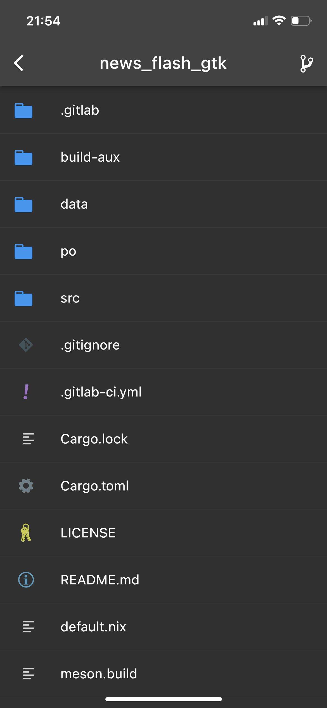
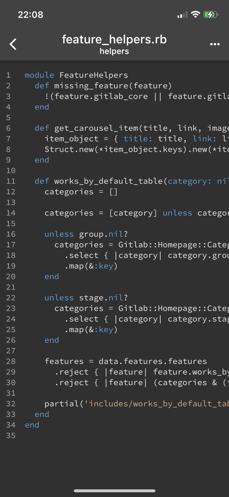

# Git+ for GitLab

Git+ is your ultimate GitLab mobile app that lets you interact with your projects like as if you were using desktop.

Git+ lets you see the latest happenings wherever you are, reply to issues so they can be taken care of faster, manage and organise projects with labels, browse your files, code and more !

Git+ lets you:

- Browse your latest notifications
- Read, react, and reply to Issues and Pull Requests
- Organise Issues with labels, assignees, projects, and more
- Browse your files and code
- Adding multiple accounts

## Quick start

1. Install flutter https://docs.flutter.dev/get-started/install
2. Install FVM https://fvm.app/docs/getting_started/overview
3. In the app root directory run following command `fvm use 2.5.3`

## Screenshots

<table>
  <tr>
    <td></td>
    <td></td>
  </tr>
 </table>
<table>
  <tr>
    <td></td>
    <td></td>
  </tr>
 </table>

<table>
  <tr>
    <td></td>
    <td></td>
  </tr>
 </table>
<table>
  <tr>
    <td></td>
    <td></td>
  </tr>
 </table>
